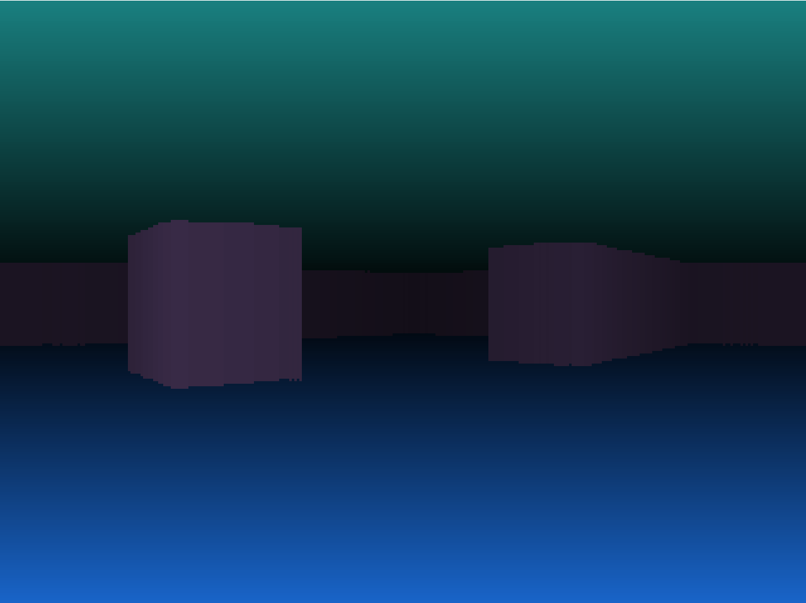
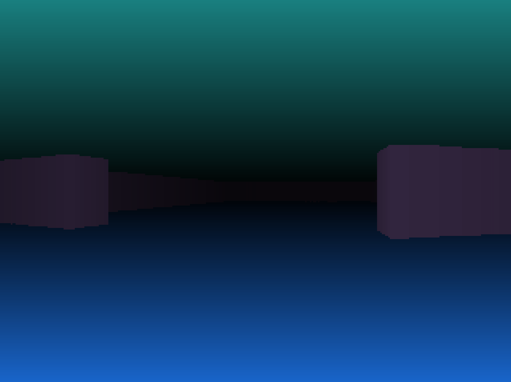

# SimplePythonRaycaster
A simple raycaster implemented in Python using PyGame.

## Screenshots

## Useful Resources
* [lodev.org - Raycasting](https://lodev.org/cgtutor/raycasting.html)
* [RayCastingTutorial](https://github.com/vinibiavatti1/RayCastingTutorial)

## Contributing
I don't plan on accepting pull requests, this is a small personal project.
