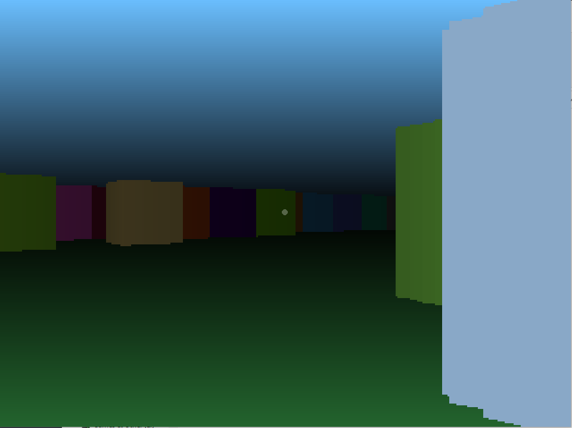

# SimplePythonRaycaster
A simple raycaster implemented in Python using PyGame. Uses opensimplex to randomly generate grid cells. Requires PyGame and opensimplex to be installed.

## Controls
* Up and down array move you forward and back
* Left and right rotate your view
* P toggles the 2d preview
* Space deletes the cells in front of you (use this if you spawn inside of a cell)

## Screenshots

## Useful Resources
* [lodev.org - Raycasting](https://lodev.org/cgtutor/raycasting.html)
* [RayCastingTutorial](https://github.com/vinibiavatti1/RayCastingTutorial)

## Contributing
I don't plan on accepting pull requests, this is a small personal project.
